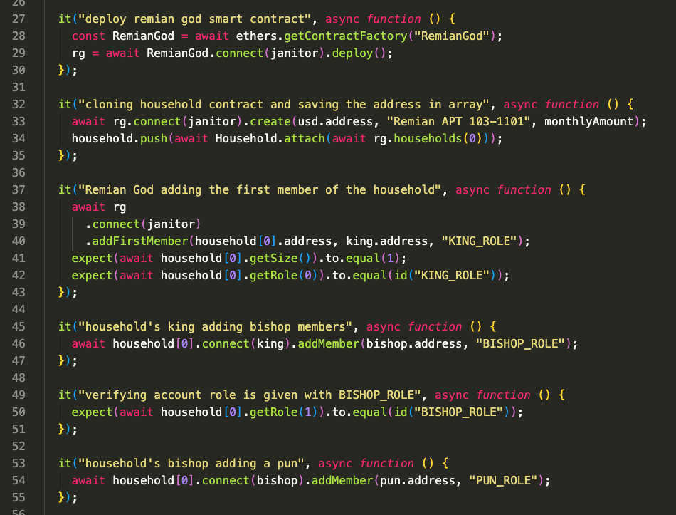

# RemianVerse

The project demonstrates a guidance into the Remianverse. But why is it called Remianverse? Simple. \ Remian is the most common apartment one can find in Seoul, Korea.

But before we dive into the code, you need to understand the eco-system.

* There are 4 different roles in remianverse:


* God can create a RemianGod Apartment


* And God can decide the first tenant of each household unit


* King, bishop and pun can only perform their duties soley inside the dedicated household
* All members can fund the utility bills
* King mainly controls the funds. 
* Bishop controls the members. 
* Pun just acts as a member
> Each member's actions are logged in the smart contract


* If the liabilities pile up and a household accumulated 6 months of unpaid utility bills, God can perform distrain orders to destroy the household and the members


# Now, let's jump into the instruction
This project demonstrates a readable instructions with use cases in the test folder. 

Open a new terminal and run these commands:
```shell
git https://github.com/vuegoman/remianverse.git
cd remianverse
npm install
```

> craete .secret file on the root of this project and input your private key

> simpley update .secret.key to ➡️ .secret file

Once all the libraries are downloaded,
open ➡️  test/remian-verse-instruction.js
* 📃 remian-verse-instruction.js illustrates step-by-step guidance to understand one of the the scenarios in remianverse 📄


* 📃 Every function and declaration has comments / descriptions on what they do📄


> To run the test in localhost:
```shell
npx hardhat test
```

* running "npx hardhat test" will out the logs on the terminal


> To run the test in ganache:
```shell
npx hardhat --network ganache test
```

> To run the test in rinkeby testnet (make sure you get the faucet):
```shell
npx hardhat run scripts/remian-verse-testnet-deploy.js --network rinkeby
```

> One can check the logs while deploying it on the testnet


sample Remian smart contract is deployed on rinkeby
https://rinkeby.etherscan.io/address/0x1d177a30840B2D4cC15D55C9c651882D0687aCd3
> Remianverse is written in solidity